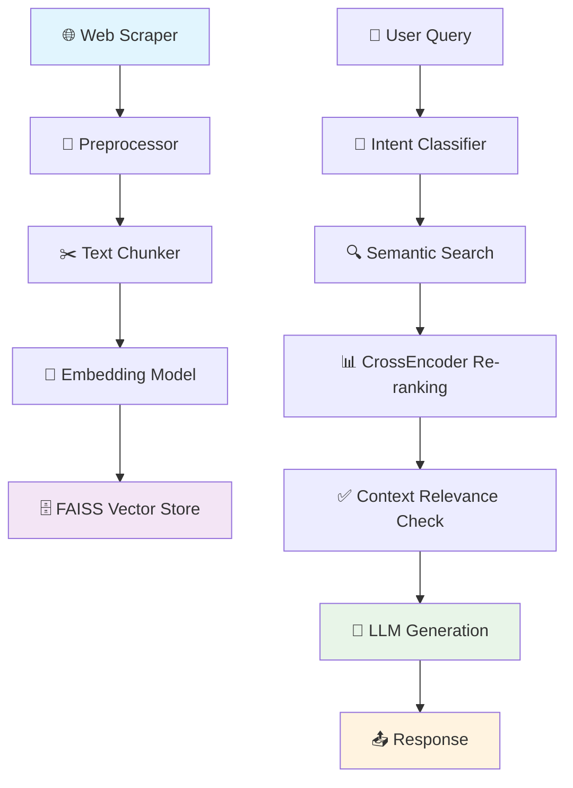
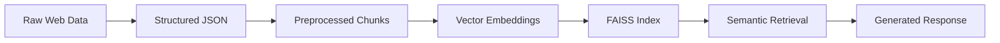

<div align="center">

# 🤖 Organization-Specific RAG Assistant Bot

[](https://www.python.org/downloads/)
[](https://pytorch.org/)
[](LICENSE)
[](https://fastapi.tiangolo.com)
[](https://www.docker.com/)
[](https://github.com/psf/black)

**Enterprise-Grade Retrieval-Augmented Generation Chatbot for Intelligent Organization Assistance**

[🚀 Features](#-key-features) • [📋 Installation](#-installation) • [🏗️ Architecture](#️-architecture) • [📚 Documentation](#-api-documentation) • [⚡ Quick Start](#-quick-start) • [🧪 Evaluation](#-evaluation)

---

</div>

## 🌟 Overview

An advanced **Retrieval-Augmented Generation (RAG)** chatbot designed for organizations seeking intelligent, context-aware customer support and information retrieval. Built with enterprise-grade architecture, this system combines cutting-edge NLP techniques with scalable infrastructure to deliver accurate, real-time responses about organizational services, expertise, and capabilities.

**Perfect for:** Customer service automation, internal knowledge management, lead qualification, and 24/7 intelligent assistance.

---

## 🚀 Key Features

### 🎯 **Core Capabilities**
- **🔍 Intelligent Document Retrieval** - FAISS-powered semantic search with re-ranking
- **🧠 Advanced RAG Pipeline** - End-to-end processing from scraping to generation
- **⚡ Real-time Responses** - Sub-second query processing with context awareness
- **🎨 Modern UI/UX** - Clean Streamlit interface with interactive elements
- **📊 Built-in Analytics** - Query logging and performance evaluation

### 🛠️ **Technical Excellence**
- **🏗️ Modular Architecture** - Microservices-ready with clean separation of concerns
- **🔧 Highly Configurable** - Environment-based configuration management
- **🐳 Docker Ready** - Containerized deployment for easy scalability
- **📈 Performance Optimized** - GPU acceleration and efficient memory usage
- **🧪 Comprehensive Testing** - Built-in evaluation framework with metrics

### 🌐 **Enterprise Features**
- **🔒 Production Ready** - Robust error handling and logging
- **📱 API-First Design** - RESTful APIs for easy integration
- **🎛️ Intent Classification** - Smart query routing and handling
- **📋 Context Validation** - Relevance checking for accurate responses
- **🔄 Scalable Processing** - Efficient batch processing and caching

---

## 🏗️ Architecture

### System Overview


### Data Flow Pipeline


---

## 📁 Project Structure

```
Organization-Specific-RAG-Assistant-Bot/
├── 🖥️  app/                          # Frontend Application
│   ├── __init__.py
│   └── streamlit_app.py              # Main Streamlit UI
├── 🚀 backend/                       # Backend Services
│   ├── __init__.py
│   ├── config.py                     # Backend configuration
│   ├── main.py                       # FastAPI application
│   ├── logger.py                     # Logging utilities
│   ├── 🧠 core/                      # Core Logic
│   │   ├── intent_classifier.py      # Query intent detection
│   │   └── rag_pipeline.py          # Main RAG implementation
│   ├── 📋 schemas/                   # Data Models
│   │   ├── pydantic_input.py        # Input validation
│   │   └── pydantic_output.py       # Output formatting
│   └── 🛠️  utils/                    # Utility Functions
│       ├── call_llm.py              # LLM interaction
│       └── context_relevance_checker.py
├── 💾 data/                          # Data Storage
│   ├── accumulated_data/            # Structured organizational data
│   ├── preprocessed_data/           # Cleaned text chunks
│   └── scraped_data/               # Raw scraped content
├── 🧮 embeddings/                    # Vector Store
│   ├── faiss_index_itobuz.index    # FAISS vector index
│   ├── chunk_metadata_itobuz.pkl   # Chunk metadata
│   └── id_mapping_itobuz.db        # ID mappings
├── 🧪 eval/                         # Evaluation Framework
│   ├── eval_rag.py                 # Performance evaluation
│   └── test_queries.jsonl          # Test query dataset
├── 📊 logs/                         # Application Logs
├── 🕷️  website_scraper/             # Advanced Web Scraping
│   ├── cli.py                      # Command-line interface
│   ├── scraper.py                  # Main scraper logic
│   ├── settings.py                 # Scraper configuration
│   ├── spiders/                    # Scrapy spiders
│   └── utils/                      # Helper utilities
├── 🐳 Dockerfile                    # Container configuration
├── ⚙️  config.py                    # Global configuration
├── 🚀 launch.py                     # Application launcher
└── 📋 requirements.txt              # Dependencies
```

---

## 📋 Installation

### Prerequisites
- **Python 3.10+** (3.11 recommended)
- **CUDA-compatible GPU** (optional, for acceleration)
- **Docker** (optional, for containerized deployment)
- **8GB+ RAM** (16GB recommended for optimal performance)

### 🔧 Environment Setup

```bash
# Clone the repository
git clone https://github.com/satyaki-mitra/Organization-Specific-RAG-Assistant-Bot.git
cd Organization-Specific-RAG-Assistant-Bot

# Create virtual environment
python -m venv venv
source venv/bin/activate  # On Windows: venv\Scripts\activate

# Install dependencies
pip install -r requirements.txt

# Download required NLTK data
python -c "import nltk; nltk.download('punkt')"

# Download spaCy model
python -m spacy download en_core_web_sm
```

### 🐳 Docker Deployment

```bash
# Build the Docker image
docker build -t rag-assistant .

# Run the container
docker run -p 8000:8000 -p 8501:8501 rag-assistant
```

---

## ⚡ Quick Start

### 1. 🕷️ Data Collection & Preprocessing

```bash
# Step 1: Scrape organizational website
python run_scraper.py

# Step 2: Preprocess and structure data
python preprocess.py

# Step 3: Generate embeddings and build vector index
python embedder.py
```

### 2. 🚀 Launch Application

```bash
# Option 1: Launch both backend and frontend
python launch.py

# Option 2: Launch services separately
# Terminal 1 - Backend API
cd backend && python main.py

# Terminal 2 - Frontend UI
streamlit run app/streamlit_app.py
```

### 3. 🌐 Access Your Assistant

- **🖥️ Web Interface**: [http://localhost:8501](http://localhost:8501)
- **🔗 API Documentation**: [http://localhost:8000/docs](http://localhost:8000/docs)
- **📊 Health Check**: [http://localhost:8000/health](http://localhost:8000/health)

---

## 🎛️ Configuration

### Core Settings (`config.py`)

```python
# Model Configuration
EMBEDDING_MODEL = "intfloat/e5-large-v2"        # Embedding model
LLM_NAME = "HuggingFaceH4/zephyr-7b-alpha"      # Language model
RERANK_MODEL = "cross-encoder/ms-marco-MiniLM-L-6-v2"

# Retrieval Parameters
TOP_K = 5                    # Number of chunks to retrieve
SCORE_THRESHOLD = 0.75       # Minimum relevance score
MAX_TOKENS_PER_CHUNK = 512   # Chunk size limit

# API Configuration
API_PORT = 8000             # Backend port
STREAMLIT_PORT = 8501       # Frontend port
LOG_LEVEL = "INFO"          # Logging level

# Performance Settings
USE_GPU = True              # Enable GPU acceleration
BATCH_SIZE = 32            # Processing batch size
CACHE_SIZE = 1000          # Response cache size
```

---

## 📚 API Documentation

### Core Endpoints

#### 💬 Chat Completion
```http
POST /chat
Content-Type: application/json

{
    "query": "What services does the organization offer?",
    "conversation_id": "optional-session-id",
    "max_tokens": 512
}
```

#### 🔍 Semantic Search
```http
POST /search
Content-Type: application/json

{
    "query": "blockchain development",
    "top_k": 5,
    "threshold": 0.7
}
```

#### 📊 Health Check
```http
GET /health
```

### Response Format
```json
{
    "response": "Generated answer text...",
    "sources": [
        {
            "chunk_id": "chunk_123",
            "content": "Source content...",
            "score": 0.85,
            "metadata": {...}
        }
    ],
    "processing_time": 1.23,
    "conversation_id": "session-uuid"
}
```

---

## 🧪 Evaluation & Testing

### Performance Metrics

```bash
# Run comprehensive evaluation
python eval/eval_rag.py

# Custom evaluation with specific queries
python eval/eval_rag.py --test-file custom_queries.jsonl
```

### Evaluation Results
- **📈 Precision@K**: Relevance accuracy at top-K results
- **⚡ Response Time**: Average query processing time
- **🎯 Intent Accuracy**: Classification performance
- **📊 Context Relevance**: Retrieved content quality

### Sample Test Queries
```json
{"query": "What healthcare solutions does the company provide?", "expected_topics": ["healthcare", "medical", "solutions"]}
{"query": "How can I contact the organization?", "expected_topics": ["contact", "phone", "email", "address"]}
{"query": "What technologies do you use for blockchain development?", "expected_topics": ["blockchain", "technology", "development"]}
```

---

## 🛠️ Technology Stack

| Component | Technology | Purpose |
|-----------|------------|---------|
| **🧠 Language Model** | HuggingFace Transformers | Text generation |
| **🔍 Embeddings** | Sentence Transformers | Semantic encoding |
| **🗄️ Vector Store** | FAISS | Similarity search |
| **🎯 Re-ranking** | Cross-Encoder | Result refinement |
| **🚀 Backend API** | FastAPI + Uvicorn | REST API service |
| **🖥️ Frontend** | Streamlit | Interactive UI |
| **🕷️ Web Scraping** | Scrapy + BeautifulSoup | Data collection |
| **📊 Data Processing** | Pandas + NumPy | Data manipulation |
| **🐳 Deployment** | Docker | Containerization |
| **📝 Logging** | Python Logging | Monitoring |

---

## 🔧 Advanced Configuration

### Custom Data Sources

1. **📁 Add new data files** to `data/accumulated_data/`
2. **🔄 Run preprocessing**: `python preprocess.py`
3. **🧮 Rebuild embeddings**: `python embedder.py`
4. **🚀 Restart application**: `python launch.py`

### Model Customization

```python
# config.py - Custom model settings
CUSTOM_MODEL_CONFIG = {
    "embedding_model": "your-custom-embedding-model",
    "llm_model": "your-custom-llm",
    "max_sequence_length": 1024,
    "temperature": 0.7,
    "top_p": 0.9
}
```

### Scaling Configuration

```python
# For high-traffic scenarios
PERFORMANCE_CONFIG = {
    "enable_caching": True,
    "cache_ttl": 3600,  # 1 hour
    "worker_processes": 4,
    "max_concurrent_requests": 100,
    "enable_gpu_batching": True
}
```

---

## 📊 Monitoring & Analytics

### Query Analytics
- **📈 Usage patterns** and trending topics
- **⚡ Performance metrics** and response times
- **🎯 Accuracy tracking** with user feedback
- **💾 Storage utilization** and index statistics

### Logging Structure
```json
{
    "timestamp": "2025-01-15T10:30:00Z",
    "query": "user question",
    "response_time": 1.23,
    "retrieved_chunks": 5,
    "relevance_scores": [0.89, 0.85, 0.78],
    "session_id": "uuid",
    "user_satisfaction": "positive"
}
```
---

## 📄 License

This project is licensed under the **MIT License** - see the [LICENSE](LICENSE) file for details.

---

## 🙏 Acknowledgments

- **🤗 HuggingFace** for transformer models and tools
- **⚡ FastAPI** for the excellent web framework
- **🎨 Streamlit** for the intuitive UI framework
- **🧠 Facebook AI** for FAISS vector search
- **🌐 Scrapy** for robust web scraping capabilities

---

<div align="center">


## 🙋 Author

**Satyaki Mitra**  
*Data Scientist | AI-ML Enthusiast*

---

*Empowering organizations with intelligent, context-aware AI assistance*

[](https://github.com/satyaki-mitra)
[](https://linkedin.com/in/your-profile)

</div>
